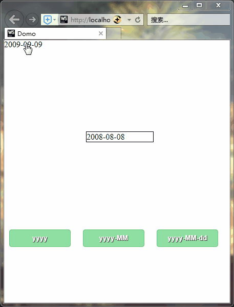

# DateTime

#### 介绍
提供年、月、日、星期、周的原生JavaScript控件

#### 测试

##### 谷歌：


##### 火狐：


##### IE11




#### 使用说明

``` html
<!--测试一-->
<div id="MyDate1"></div>
<!--测试二-->
<div id="MyDate2" style=" margin: 160px;width: 130px;border: solid #000000 1px;"></div>


<script src="DateTimeXYZS.NoStyle.min.js"></script>
<link rel="stylesheet" href="DateTimeXYZS.min.css">


<script>
    window.onload = function () {
        //测试一
        var date1 = new DateTimeXYZS(document.getElementById("MyDate1"));
        date1.DateTimeLoad(new Date(2009, 8, 9))
        //测试二
        var date = new DateTimeXYZS("MyDate2");
        date.DateTimeLoad(new Date(2008, 7, 8), function (date) {
            alert("当前选择时间：" + date.toString())
        })
    }
</script>

```

